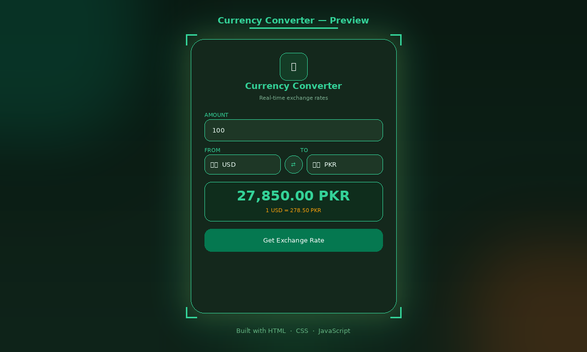

# 💱 Currency Converter

A sleek, real-time currency converter built with pure **HTML**, **CSS**, and **JavaScript** — featuring live exchange rates, smooth animations, and an emerald & gold aurora theme.

---

## 🖼️ Preview



---

## ✨ Features

- 🌍 Live exchange rates via free currency API
- 🏳️ Auto-updating country flags on currency change
- 🔄 Swap button to instantly reverse currencies
- 💚 Emerald & gold gradient theme with aurora blob background
- ✨ Shimmer animated title & pulsing icon
- 📊 Animated result pop-in with formatted output
- ⚡ Auto-converts on page load
- 🔁 Loading state on button while fetching

---

## 📁 Project Structure

```
CurrencyConverter/
├── index.html     # Markup & structure
├── style.css      # Animations, aurora theme & layout
├── script.js      # Converter logic & API calls
├── codes.js       # Country code to currency mapping
└── preview.png    # Screenshot for README
```

---

## 🚀 Getting Started

1. **Clone the repo**
   ```bash
   git clone https://github.com/your-username/currency-converter.git
   cd currency-converter
   ```

2. **Open in browser**
   ```bash
   # No build step needed — just open directly
   open index.html
   ```

> ⚠️ Requires an internet connection to fetch live rates.

---

## 🌐 API Used

This project uses the free [Currency API](https://github.com/fawazahmed0/exchange-api):

```
https://2024-03-06.currency-api.pages.dev/v1/currencies/{currency}.json
```

No API key required.

---

## 🛠️ Customization

### Change default currencies
In `script.js`, update the selected conditions:
```js
if (code === "USD") o1.selected = true;  // From currency
if (code === "PKR") o2.selected = true;  // To currency
```

### Change accent color
In `style.css`, replace `#34d399` (emerald) with your preferred color:
```css
.header-icon  { color: #34d399; }
.amount-input:focus { border-color: #34d399; }
.result-amount { color: #34d399; }
```

### Change button gradient
```css
.convert-btn {
  background: linear-gradient(135deg, #059669, #d97706);
}
```

---

## 🎬 Animations Used

| Animation | Effect |
|-----------|--------|
| `fadeUp` | Card slides up on page load |
| `blobFloat` | Aurora blobs drift around the background |
| `shimmer` | Title text has a moving emerald→gold shine |
| `pulse` | Header icon glows softly |
| `resultPop` | Result box scales in on conversion |
| `iconSpin` | Button icon spins while loading |
| `swapSpin` | Swap button rotates 180° on click |

---

## 🎨 Color Palette

| Element | Color |
|---------|-------|
| Background | `#0a1a12` — Deep Forest |
| Primary accent | `#34d399` — Emerald Green |
| Secondary accent | `#fbbf24` — Amber Gold |
| Button gradient | `#059669` → `#d97706` |
| Card surface | `rgba(255,255,255,0.04)` |

---

## 🙋‍♀️ Author

**Kaneeza Batool**
CS Undergraduate · Sukkur, Pakistan
Built with 💚 using HTML, CSS & JS
